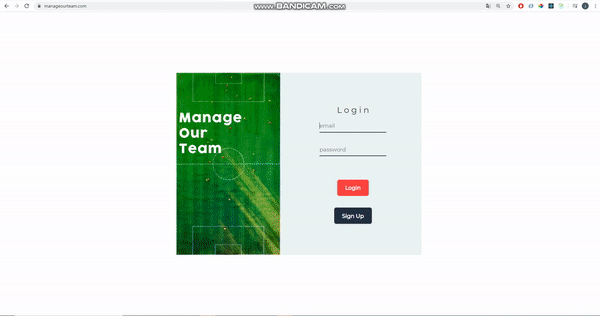
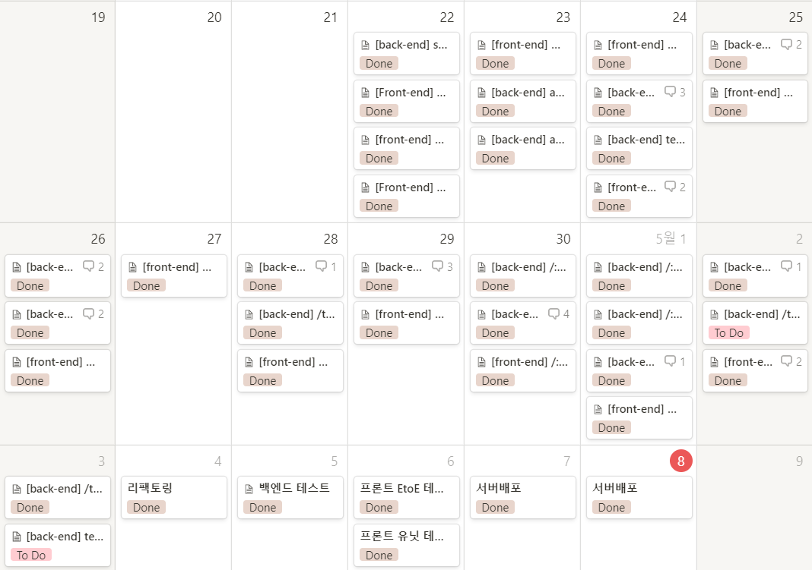

# MOT- Manage Our Team

## Introduction

MOT 는 축구나 풋살을 좋아하는 사람들을 위해 만들어진 웹 애플리케이션입니다. 축구팀을 쉽게 관리할 수 있게 도와주는 유용한 애플리케이션입니다.



## Table of contents

- Deployment
- Project Control
- Technologies
- Setup
- Features
- Challenges
- Things  to Do

## Deployment

### Clinet

- 클라이언트 배포는 Netlify를 통해 배포가 이루어졌습니다.

### Server

- 아마존의 Elastic Beanstalk를 통해 배포가 이루어졌습니다.

## Project Control

- Git Branch를 통해서 개발이 진행되었습니다.
- 노션을 통해서 개발 일정, 작업이 조율이 되었습니다.
- MOT 프로젝트는 3주간의 기간을 통해 개발이 진행되었습니다.  아래와 같은 태스크카드를 만듦으로써, 작업의 효율성을 최대한 끌어올렸습니다. 최대한 그날그날 정해진 일정 안에 정해진 태스크를 완료하기 위해 많은 노력을 하였습니다.



## Technologies

MOT 애플리케이션을 만들 때 사용되었던 기술 스택들입니다.

### Front-end

- Chart JS
- ES2015+
- Jest/ Enzyme
- React
- React Router
- Redux

### Back-end

- Atlas
- ES2015+
- Express
- JWT
- Mongo DB
- Mongoose
- Node JS

## Setup

- 프로젝트를 로컬 컴퓨터 상에서 구동하기 위해서는 환경변수들에 필요한 값들을 넣어주셔야 합니다.

```jsx
https://github.com/dizkek/MOT-Client
cd  Streetcat-Client
npm install
npm start or npm run server

REACT_APP_GOOGLE_API = 구글 API 키
```

```jsx
https://github.com/dizkek/Streetcat-Server
cd Streetcat-Server
npm install
npm start

DB_URI = 몽고DB URI
SECRET = 커스텀 세션 시크릿 키
JWT_KEY = 커스텀 JWT 시크릿 키
EMAIL_API_KEY = SendGrid API 키
SG_ID = SendGrid 아이디
SG_PASS= SendGrid 비밀번호
```

## Features

- MOT의 메인 페이지는 팀에 기반을 둔 페이지이므로, 팀이 없으면 접속할 수 없습니다.
- 팀의 운영자들이 사용자들에게이메일을 보냄으로써 팀에 초대를 할 수가 있습니다.
- 초대된 사용자들은 이메일 인증을 해야 팀 가입이 가능합니다.
- 메인 페이지는 팀의 공지사항을 보여주는 페이지입니다.
- 포메이션 메뉴에서는 기본적으로 팀의 현재 전술을 화면 상에 보여줍니다.  경기에 나갈 선수들의 베스트일레븐을 정하고, 전술판에 드래그 앤 드랍으로 전술을 수정할 수 있습니다.
- 매치 메뉴에서는 이번 주에 등록된 경기를 보여줍니다. 경기 날짜, 시간, 장소와 상대 팀을 정해서 저장을 할 수가 있고, 장소 이름을 치면 좌표를 받아서 화면에 표시해 줍니다.
- 포럼 메뉴는 팀원들이 커뮤니케이션을 할 수 있는 공간이고, 좋아요, 댓글 남기기, 글 작성하기 등의 기본적인 기능들이 구현돼 있습니다.
- 재정 메뉴는 팀원들의 회비 내역이 어떻게 사용되었는지 확인할 수 있습니다.  각 달의 지출내역을 파이와 도넛 차트로 보여주고, 지난달 회비내역을 확인 가능합니다.
- 멤버스 페이지는 오직, 운영자만 확인이 가능한 페이지 입니다.  이 페이지에서 팀 초대를 할 사용자들에게 초대 이메일을 보낼 수 있고, 현재 팀원 목록들 확인이 가능합니다.

## Challenges

- 개발초기에 리엑트 라우터 구조를 잘못 설계해서 페이지가 할당된 주소대로  랜더링이 되지 않는 문제가 발생하였습니다. 리엑트 라우터의 공식 문서를 상세하게 보면서 기본적인 Router, Link, Switch 에 관한 사용방법들을 상세하게 공부를 하였고, 그 과정에서 useHistory라던지 match등의 쓰임새에 대해서 알게 되었습니다. 특히 Nesting에 관한 부분을 집중적으로 공부하면서, 메인 페이지의 메뉴들에 대해서 Nesting 스타일 라우터를 적용을 해서 문제 해결을 하게 되었습니다.
- 리덕스 정규화를 하지 않고 프로젝트를 진행을 하다가 어느순간부터, 서버에서 받은 데이터의 종류들이 다양해 지다보니, 리덕스 구조의 nesting이 너무 깊어서 데이터를 원할하게 사용하는데 어려움을 겪었습니다. 이를 해결하기 위해서 CRUD기능을 사용하는 리덕스 스테이트들은 리듀서를 따로 분리를 해서 정규화를 진행을 해서 데이터를 원활히 사용할 수 있게 해결을 하였습니다.

## Things to Do

- CSS를 반응형으로 변경을 해도 어떤사이즈에도 대응할 수 있는 UI가 필요.
- 캘린더를 별로도 만들어서 Match메뉴에 연동이 될 수 있게 기능적인 면 추가필요.